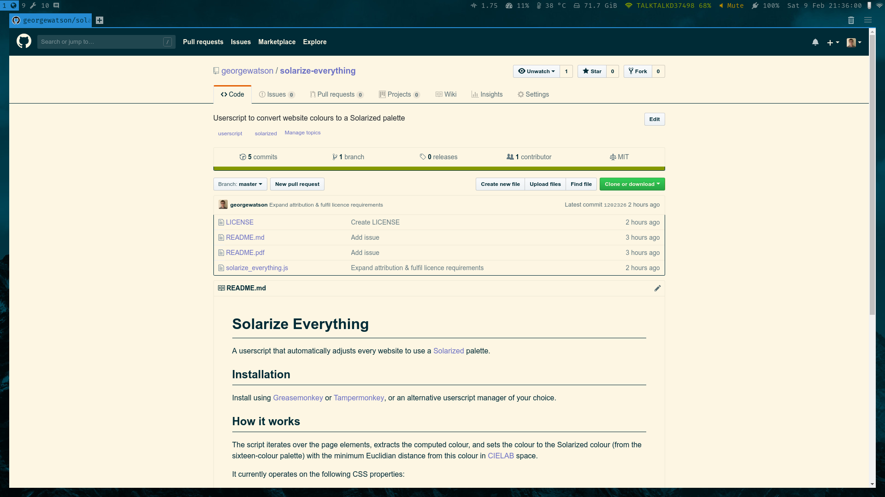
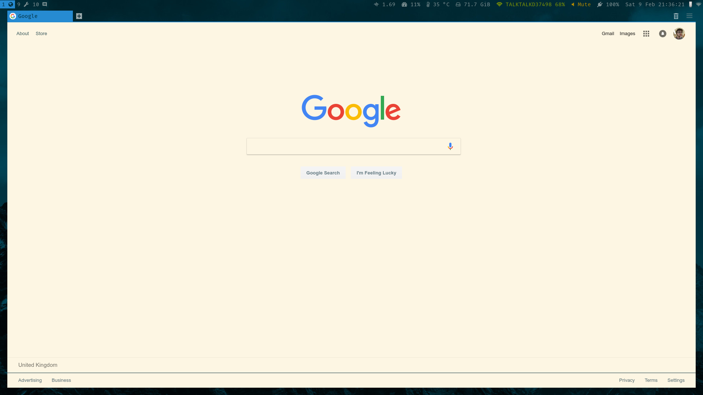
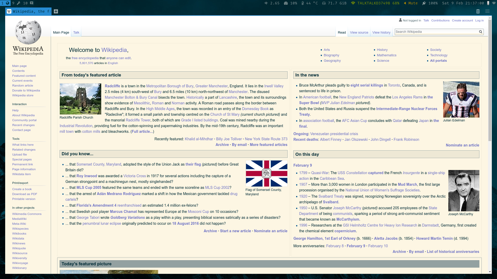

# Solarize Everything

A userscript that automatically adjusts every website to use a
[Solarized](https://ethanschoonover.com/solarized/) palette.

## Installation

Install using
[Greasemonkey](https://addons.mozilla.org/en-GB/firefox/addon/greasemonkey/) or
[Tampermonkey](https://chrome.google.com/webstore/detail/tampermonkey/dhdgffkkebhmkfjojejmpbldmpobfkfo?hl=en),
or an alternative userscript manager of your choice.

## How it works

The script iterates over the page elements, extracts the computed colour, and
sets the colour to the Solarized colour (divided into foreground and background
palettes) with the minimum Euclidian distance from this colour in
[CIELAB](https://en.wikipedia.org/wiki/CIELAB_color_space) space.

It currently operates on the following CSS properties:
* `color` (text colour)
* `background-color` and variants
* `border-color` and variants

## Examples

## Known issues

* While most sites are greatly improved by the new palette, some may look a bit
  ugly. The script can generally be disabled on a per-site basis in your
  userscript settings.
* Elements not present on the initial page load do not have their colours
  modified ([#1](https://github.com/georgewatson/solarize-everything/issues/1))
* Gradient backgrounds are not currently solarized ([#2](https://github.com/georgewatson/solarize-everything/issues/2))
* Websites that don't explicitly set a background colour retain their white (or
  browser-default) background ([#3](https://github.com/georgewatson/solarize-everything/issues/3))
* Images are not currently recoloured (and probably never will be)
* The examples above demonstrate an old version of the script; recolouring has
  since been moderately improved
* I am terrible at JavaScript.
